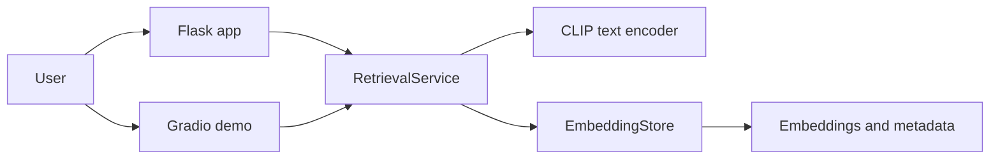
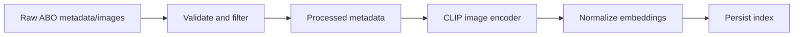
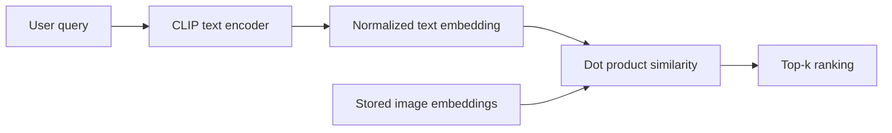

# Architecture

The repository separates application interfaces from reusable retrieval logic. Flask is the primary
server-rendered application. Gradio is an optional demonstration surface. Both call
`packages/retrieval/`.

## Offline Embedding Generation

## Online Retrieval

Data and generated artifact boundaries are explicit: `data/`, `artifacts/`, and `results/` are local
runtime areas, not source files. Model loading is lazy and cached by configuration. Failures at the
dataset, index, model, and HTTP boundaries are converted into actionable messages.
